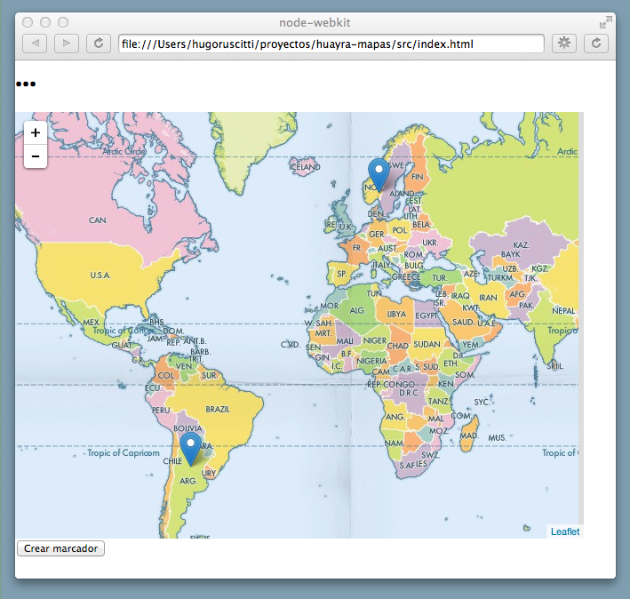

huayra-mapas
============

Un prototipo de aplicación para visualizar mapas offline y permitir
intervenciones, como creación de puntos o polígonos:

La idea general de este prototipo es evaluar si es viable hacer una
aplicación de geografía que no requiera acceso a Internet y permita
editar/construir infografías libremente.

Instrucciones para ejecutar la aplicación
-----------------------------------------

Si tenés huayra en tu equipo, podés usar la aplicación
realizando estos 3 comandos desde un terminal:

  git clone https://github.com/hugoruscitti/huayra-mapas.git
  cd huayra-mapas
  nw src

En otros sistemas tendrías que bajar
[node-webkit](https://github.com/rogerwang/node-webkit) e integrarlo
a la aplicación.

¿Cómo funciona?
---------------

La aplicación está construída usando [node-webkit](https://github.com/rogerwang/node-webkit), dos
bibliotecas llamadas [leaflet](http://leafletjs.com/) y [angularjs](http://angular-ui.github.io/)
junto a una directiva que integra ambas llamada
[angular-leaflet-directive](http://tombatossals.github.io/angular-leaflet-directive/#!/).

[leaflet](http://leafletjs.com/) es la biblioteca más importante de la
aplicación, se encarga de dibujar el mapa y permitir algo de interactividad
como agregar puntos, cambiar el zoom de la aplicación etc.

El detrás de escena
-------------------

La aplicación incluye varios mapas en formato offline, todos están el directorio
[mapas](https://github.com/hugoruscitti/huayra-mapas/tree/master/src/mapas), separados
en capas o layers.

Estas imágenes se guardan a su vez en directorios de la forma "z/x/y", que contienen
todos los mosaicos que [leaflet](http://leafletjs.com/) usa para visualizar el mapa.

Esta forma de organizar los mosaicos es muy similar a la que usan varios
servicios web de mapas, por ejemplo 

Sitios para ver
---------------

- https://github.com/springmeyer/tilelite
- http://www.ign.gob.ar/NuestasActividades/sigign#descarga
